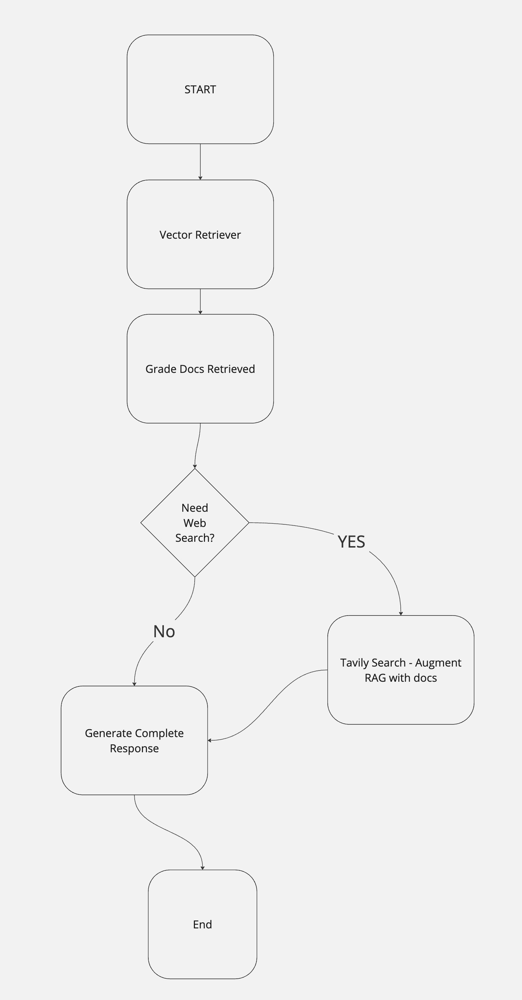

# Description

This in an example of using langgraph, which adds a decision tree to the ai application.
In this code, the graph will add web search to the steps if the documents from
the vector store are not all relevant.

It shows how a standard rag can be augmented with other steps.  In this case, a web search
when the documents that have been split and embedded do not match the user's query.

## Running Locally

There are commands in the `.justfile`.

- `just run`: calls the python code that runs the evaluation of the application
- `just run search`: calls the python code to run just the search (no evaluation)

## Running Slideshow

cd into `slidev` dir and then run command

```bash
cd slidev
npm run dev
```

## Unit test - pytest

In the `unit_test` branch, there is unit test file that
programmatically checks for successful evaluations.

## Resources from langchain team

The code example is from langchain and has an accompanying youtube video:

- [Example code from langchain](https://github.com/langchain-ai/langgraph/blob/main/examples/rag/langgraph_crag_local.ipynb)
- [Youtube from langchain](https://youtu.be/E2shqsYwxck?si=3qbn55sbj96tJcid)

## Graph Steps

- retrieves docs and then checks if all the docs are relevant for the query search
- if not all relevant then use Tavily to search web
- if any documents are relevant to the query they are included in the ultimate prompt

### Langgraph Diagram



