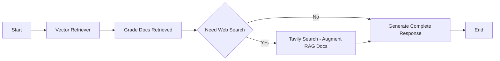

---
# You can also start simply with 'default'
theme: seriph
# random image from a curated Unsplash collection by Anthony
# like them? see https://unsplash.com/collections/94734566/slidev
# some information about your slides (markdown enabled)
title: PSG - Langchain
# apply unocss classes to the current slide
class: text-center
# https://sli.dev/features/drawing
drawings:
  persist: false
# slide transition: https://sli.dev/guide/animations.html#slide-transitions
transition: slide-left
# enable MDC Syntax: https://sli.dev/features/mdc
mdc: true
---

# Langchain + Evaluation

Pinnacle Solutions Group

Using langchain to augment a RAG <br>
Using evaluation to unit test the llm application

---
---
# What

## Langgragh

(from langchain): Library to build stateful, multi-actor applications
<br>(Chad words): Decision tree to extend an llm application
- cycles and loops
- persist state
- human in the loop

## Evaluation

Testing of application using a defined truth as comparison to response for grading.

---
---
# Langgraph Flow

## Scenario

You have a RAG of documents on delta-rs.<br>
The vector db will retrieve the closest documents to your query but may not be relevant.<br>
You add a step to check for relevancy and augment with a web search if needed.

## Flow of llm application



Focus:<br>
building the graph<br>
grading docs<br>
evaluation of application

---
layout: two-cols
layoutClass: gap-16
---
# Graph State

```python {all|2,22}
# Create state structure
class GraphState(TypedDict):
    """
    State of lang graph

    Attributes:
        query: query
        generation: LLM generation
        search: whether to add search
        documents: list of documents
    """

    query: str
    generation: str
    retriever: VectorStoreRetriever
    web_search: bool
    documents: list[str]
    steps: list[str]

# Set up the langgraph object
def run_graph(query: str) -> str:
    workflow = StateGraph(GraphState)
    workflow.add_node("vector_retriever", get_vector_store)
    ...

```

::right::

State is passed between nodes of the graph

```python {all|2,7-11}
# GraphState is passed as a parameter to the function
def get_vector_store(state: GraphState) -> dict:
    state["steps"].append("get_vector_store")
    vector_store = create_vector_store(get_split_docs())
    retriever = vector_store.as_retriever(search_kwargs={"k": 2})
    # return a dict that maps to GraphState
    return {
        "query": state["query"],
        "retriever": retriever,
        "steps": state["steps"],
    }

```
---
---
# Create DAG

```python {all|2|3-15|20|22}
def run_graph(query: str) -> str:
    workflow = StateGraph(GraphState)
    workflow.add_node("vector_retriever", get_vector_store)
    workflow.add_node("doc_grade", check_doc_grade)
    workflow.add_node("tavily_search", web_tavily_search)
    workflow.add_node("generate", generate)

    workflow.add_edge(START, "vector_retriever")
    workflow.add_edge("vector_retriever", "doc_grade")

    workflow.add_conditional_edges(
        "doc_grade",
        decide_to_generate,
        {"search": "tavily_search", "generate": "generate"},
    )

    workflow.add_edge("tavily_search", "generate")
    workflow.add_edge("generate", END)

    custom_graph = workflow.compile()

    state_dict = custom_graph.invoke({"query": query, "steps": []})
    return state_dict["generation"]

```
---
---
# Grade Docs (1/2)

```python {all|2|16-17}
def grade_docs_for_tavily_search(retriever, question: str) -> tuple[bool, list[Document]]:
    docs = retriever.invoke(question)
    ...
    prompt = ChatPromptTemplate.from_template(
        """You are a teacher grading a quiz. You will be given:
        1/ a QUESTION
        2/ A FACT provided by the student

        You are grading RELEVANCE RECALL:
        A score of 1 means that ANY of the statements in the FACT are relevant to the QUESTION.
        A score of 0 means that NONE of the statements in the FACT are relevant to the QUESTION.
        1 is the highest (best) score. 0 is the lowest score you can give.

        Avoid simply stating the correct answer at the outset.

        Question: {question} \n
        Fact: \n\n {documents} \n\n

        Give a binary score 1 or 0 score to indicate whether the document is relevant to the question. \n
        Provide the binary score as a JSON with a single key 'score' and no premable or explanation.
        """
    )
    retrieval_grader = prompt | model | JsonOutputParser()
```

---
---
# Grade Docs (2/2)

```python {1|4}
    retrieval_grader = prompt | model | JsonOutputParser()
    ...
    more_search = len(relevant_docs) != len(docs)
    return more_search, relevant_docs
```
---
---
# Evaluation

## Data Creation
- create dataset for testing against
- store in langsmith


```python {all|2-8|14-16}
def create_dataset(client: Client):
    examples = [
        ("what's the frequency kenneth?", "Song by REM"),
        (
            "what is deltalake?",
            "Deltalake refers to the Rust API (delta-rs) or Python API (also delta-rs) of Delta Lake",
        ),
    ]
    if not client.has_dataset(dataset_name=dataset_name):
        dataset = client.create_dataset(dataset_name)
        inputs, outputs = zip(
            *[({"input": text}, {"output": label}) for text, label in examples]
        )
        _ = client.create_examples(
            inputs=inputs, outputs=outputs, dataset_id=dataset.id
        )

```
---
---
# Evaluation LLM Call

```python {all|7-15}

def answer_evaluator(run, example) -> dict:
    input_question = example.inputs["input"]
    reference = example.outputs["output"]
    prediction = run.outputs

    llm = ChatOllama(model=constants.MODEL)
    answer_grader = utils.create_chat_prompt() | llm | JsonOutputParser()

    response = answer_grader.invoke(
        {
            "query": input_question,
            "correct_answer": reference,
            "student_answer": prediction,
        }
    )
    return {"score": response["score"], "key": "answer_v_reference_score"}
```

---
---

# Evaluation Call

```python {all|7-13|8|10}
def evaluator():
    experiment_prefix = "langgraph-evaluation"

    client = Client()
    _ = create_dataset(client)

    _ = evaluate(
        run_graph,
        data=dataset_name,
        evaluators=[answer_evaluator],
        experiment_prefix=f"{experiment_prefix}-answer-and-tool-use",
        max_concurrency=1,
    )
```
---

# Langsmith Evaluation
<br><br>


---