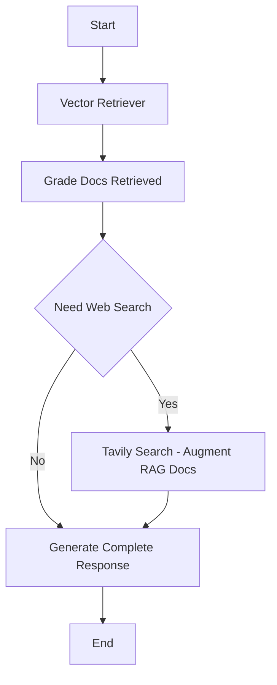

---
# You can also start simply with 'default'
theme: seriph
# random image from a curated Unsplash collection by Anthony
# like them? see https://unsplash.com/collections/94734566/slidev
background: https://cover.sli.dev
# some information about your slides (markdown enabled)
title: Welcome to Slidev
info: |
  ## Slidev Starter Template
  Presentation slides for developers.

  Learn more at [Sli.dev](https://sli.dev)
# apply unocss classes to the current slide
class: text-center
# https://sli.dev/features/drawing
drawings:
  persist: false
# slide transition: https://sli.dev/guide/animations.html#slide-transitions
transition: slide-left
# enable MDC Syntax: https://sli.dev/features/mdc
mdc: true
---

# Langchain + Evaluation

Pinnacle Solutions Group

Using langchain to augment a RAG <br>
Using evaluation to unit test the llm application


<!--
The last comment block of each slide will be treated as slide notes. It will be visible and editable in Presenter Mode along with the slide. [Read more in the docs](https://sli.dev/guide/syntax.html#notes)
-->


---
layout: two-cols
layoutClass: gap-16
---

# Table of contents

You can use the `Toc` component to generate a table of contents for your slides:

```html
<Toc minDepth="1" maxDepth="1"></Toc>
```

The title will be inferred from your slide content, or you can override it with `title` and `level` in your frontmatter.

::right::

<Toc v-click minDepth="1" maxDepth="2"></Toc>

---
---
# Langgraph Flow

Flow of llm application



---
layout: two-cols
layoutClass: gap-16
---
# Graph State

```python {all|1,20}
class GraphState(TypedDict):
    """
    State of lang graph

    Attributes:
        query: query
        generation: LLM generation
        search: whether to add search
        documents: list of documents
    """

    query: str
    generation: str
    retriever: VectorStoreRetriever
    web_search: bool
    documents: list[str]
    steps: list[str]

def run_graph(query: str) -> str:
    workflow = StateGraph(GraphState)
    workflow.add_node("vector_retriever", get_vector_store)
    ...

```

::right::

```python {all|1,5-9}
def get_vector_store(state):
    state["steps"].append("get_vector_store")
    vector_store = create_vector_store(get_split_docs())
    retriever = vector_store.as_retriever(search_kwargs={"k": 2})
    return {
        "query": state["query"],
        "retriever": retriever,
        "steps": state["steps"],
    }

```
---
---
# Create DAG

```python {all|2|12|14|15}
def run_graph(query: str) -> str:
    workflow = StateGraph(GraphState)
    workflow.add_node("vector_retriever", get_vector_store)
...
    workflow.add_conditional_edges(
        "doc_grade",
        decide_to_generate,
        {"search": "tavily_search", "generate": "generate"},
    )
...

    custom_graph = workflow.compile()

    state_dict = custom_graph.invoke({"query": query, "steps": []})
    return state_dict["generation"]

```
---
---
# Grade Docs

```python {all|1|3-9|10|12|none}
docs = retriever.invoke(question)

prompt = ChatPromptTemplate.from_template(
    """You are a teacher grading a quiz. You will be given:
...
    Give a binary score 1 or 0 score to indicate whether the document is relevant to the question. \n
    Provide the binary score as a JSON with a single key 'score' and no premable or explanation.
    """
)
retrieval_grader = prompt | model | JsonOutputParser()
...
return more_search, relevant_docs
```
```python {none|all}

# return value from grading the docs passed to decision point
workflow.add_conditional_edges(
    "doc_grade",
    decide_to_generate,
    {"search": "tavily_search", "generate": "generate"},
)
```

---
---
# Evaluation

## Data Creation
- create dataset for testing against
- store in langsmith


```python {all|2-7|14-15}
def create_dataset(client: Client):
    examples = [
        ("what's the frequency kenneth?", "Song by REM"),
        (
            "what is deltalake?",
            "Deltalake refers to the Rust API (delta-rs) or Python API (also delta-rs) of Delta Lake",
        ),
    ]
    if not client.has_dataset(dataset_name=dataset_name):
        dataset = client.create_dataset(dataset_name)
        inputs, outputs = zip(
            *[({"input": text}, {"output": label}) for text, label in examples]
        )
        _ = client.create_examples(
            inputs=inputs, outputs=outputs, dataset_id=dataset.id
        )

```
---
---
# Evaluation LLM Call

```python {all|7-15}

def answer_evaluator(run, example) -> dict:
    input_question = example.inputs["input"]
    reference = example.outputs["output"]
    prediction = run.outputs

    llm = ChatOllama(model=constants.MODEL)
    answer_grader = utils.create_chat_prompt() | llm | JsonOutputParser()

    response = answer_grader.invoke(
        {
            "query": input_question,
            "correct_answer": reference,
            "student_answer": prediction,
        }
    )
    return {"score": response["score"], "key": "answer_v_reference_score"}
```

---
---
# Evaluation Call

```python {all|7-13|8|10}
def evaluator():
    experiment_prefix = "langgraph-evaluation"

    client = Client()
    _ = create_dataset(client)

    _ = evaluate(
        run_graph,
        data=dataset_name,
        evaluators=[answer_evaluator],
        experiment_prefix=f"{experiment_prefix}-answer-and-tool-use",
        max_concurrency=1,
    )
```